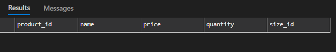

# the only T-SQL guide you'll ever need

- [About](#About)
- [Creating SQL objects](#Creating-SQL-objects)
- [Inserting data](#Inserting-data)

## About
- this is a collection of T-SQL queries and functions that I have found useful in my work
- you can practice along with this guide, but you need 2 things running on your pc
    - [SQL Server Instance](https://www.microsoft.com/en-us/sql-server/sql-server-downloads)
    - software to run T-SQL queries, like [SQL Server Management Studio](https://docs.microsoft.com/en-us/sql/ssms/download-sql-server-management-studio-ssms?view=sql-server-ver15) or [Azure Data Studio](https://docs.microsoft.com/en-us/sql/azure-data-studio/download-azure-data-studio?view=sql-server-ver15)

## Creating SQL objects
in this chapter i'll create a database for clothing store called `hatelovewear`, with a schema `shop` and a table `product` with some columns

- Create new Database
``` sql 
create database [hatelovewear]
```
later to use the already created database, just use 
``` sql 
use [hatelovewear]
```
btw, the square brackets like in `[object]` are used to avoid errors when the object name is a reserved keyword, like  `name`, `time` or to avoid spaces in the object name, generally its a good practice to use them

- Create new Schema
``` sql
create schema [shop]
```
schema is a container for objects, like tables, views, procedures, etc. it is a way to organize the database, you can have multiple schemas in your database.

- Create new Table <br>
``` sql 
create table [shop].[product] (
    [product_id] int identity(1,1) primary key,
    [name] nvarchar(50),
    [price] decimal(10,2),
    [quantity] int,
    [size_id] int,
    (tbd) foreign key ([size_id]) references [size]([size_id])
)
```
lets break it down
- `product_id` is an integer
- `identity` means `product_id` will auto increment by 1, starting from 1 when a new row is inserted
- `primary key` means `product_id` is unique and not null
- `name` is a string, with a maximum length of 50 characters
- `price` is a decimal number, with a total of 10 digits and 2 of them are after the decimal point (,)
- `size_id` is a `foreign key`, referencing to another table, in this case `[size]` table, and its `[size_id]` column (this table doesnt exist yet)
- (tbd) the last statement is the foreign key `constraint`, which means `size_id` in `product` table must exist in `[size]` table

<br> the objects selection chain is `[database].[schema].[object]` which in our case would be:
``` sql
[hatelovewear].[shop].[product]
```

you can just write the object name, but if you want to do an action for specifc schema, write the schema name too
<br> an object can be a table, view, procedure, function, cursor

final result should look like this:
``` sql
select * from [hatelovewear].[shop].[product]
```

as you can see, table is empty, which is okay, we'll insert some data later

## Inserting data


